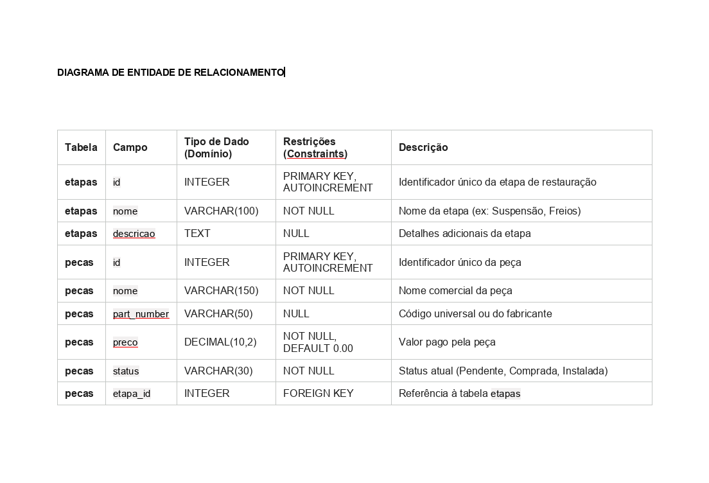

# parts-control# 🚐 Parts Control - Gestão de Restauração

Sistema web completo para gerenciar a compra, o custo e o status de instalação de peças para a restauração de veículos (focado em uma Kombi ano 2010 flex 1.4).

O sistema aplica na prática os conceitos de Engenharia de Software, testes automatizados e o padrão de arquitetura MVC (Model-View-Controller).

---

## 🛠️ Tecnologias Utilizadas
* **Back-end:** Node.js com framework Express.
* **Banco de Dados:** SQLite3 gerenciado pelo ORM Sequelize.
* **Front-end (IHC):** EJS (Template Engine) e Bootstrap 5 para estilização e responsividade.
* **Testes:** Jest e Supertest para testes unitários e de integração.

---

## 🗄️ Modelagem de Dados (Planejamento)

Para garantir a integridade dos dados, o sistema foi modelado utilizando o relacionamento de 1:N, onde uma **Etapa** de restauração possui várias **Peças** associadas.

### 1. Diagrama de Entidade-Relacionamento (DER)



### 2. Dicionário de Dados

**Tabela: `Etapas`**
| Campo | Tipo | Restrições | Descrição |
| :--- | :--- | :--- | :--- |
| `id` | INTEGER | PRIMARY KEY, AUTOINCREMENT | Identificador único |
| `nome` | VARCHAR(255) | NOT NULL | Nome da etapa (ex: Suspensão) |
| `descricao` | TEXT | NULL | Detalhes adicionais |

**Tabela: `Pecas`**
| Campo | Tipo | Restrições | Descrição |
| :--- | :--- | :--- | :--- |
| `id` | INTEGER | PRIMARY KEY, AUTOINCREMENT | Identificador único |
| `nome` | VARCHAR(255) | NOT NULL | Nome comercial da peça |
| `part_number` | VARCHAR(255) | NULL | Código do fabricante (Adicionado após validação por pares) |
| `preco` | DECIMAL(10,2) | NOT NULL, DEFAULT 0.00 | Valor da peça |
| `status` | VARCHAR(255) | NOT NULL, DEFAULT 'Pendente' | Pendente, Comprada ou Instalada |
| `etapaId` | INTEGER | FOREIGN KEY | Referência à tabela Etapas |

---

## ⚙️ Arquitetura MVC

* `/models`: Classes de mapeamento do Sequelize para geração e consulta ao banco de dados.
* `/views`: Arquivos HTML injetados dinamicamente com EJS.
* `/controllers`: Funções lógicas de recepção de dados e comunicação com os modelos.
* `/routes`: Definição dos endpoints da aplicação web.

---

## 🚀 Como Executar o Projeto

**1. Clone o repositório e acesse a pasta:**
```bash
git clone [https://github.com/Gilson-Ferrer/parts-control.git](https://github.com/Gilson-Ferrer/parts-control.git)
cd parts-control